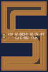
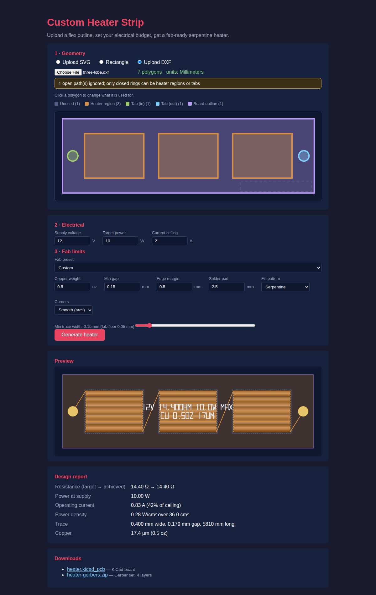

# custom-heater-strip

Turn any outline into a fab-ready resistive heater on flex PCB — in your
browser, with no server and nothing uploaded.

### ▶ [Try it: www.cosmicfrontier.org/custom-heater-strip](https://www.cosmicfrontier.org/custom-heater-strip/)

<p align="center">
  
</p>

That is a real design, not an illustration: a letter **S**, 76 × 116 mm,
asked for 12 W at 12 V and routed to **12.00 Ω** — dead on target — as a
0.57 mm trace 6.9 m long over 65.3 cm², at 0.18 W/cm². Reproduce it with:

```sh
cargo run -p engine --example hero > docs/hero-s.svg
```

It uses the **concentric** fill, because the S is exactly the case that needs
it: the scanline patterns place their solder pocket and feed lanes from the
outline's *bounding box*, which on a concave shape can put copper off the
board entirely. The engine now refuses those designs instead of emitting
them, and points you at the outline-following patterns.

Give it an outline and an electrical budget (supply voltage, target wattage,
current ceiling), and you get:

- **SVG preview** rendered live
- **KiCad board file** (`.kicad_pcb`) to open and tweak
- **Gerber X2 set** (top copper, top soldermask terminal openings, silkscreen
  legend with the design's voltage/resistance/power and copper stackup, outline)
- **Design report** — target vs. achieved resistance, operating current and
  headroom, trace width/gap/length, power density

The design engine is compiled to WebAssembly and runs in a Web Worker on your
own machine, so **your board geometry is never uploaded anywhere** and the tab
stays responsive even on the heaviest fills.

## The app



Upload a DXF, click its polygons to say what each one is, and generate. Above,
three heater lobes chained in series between two round solder tabs, hitting
14.40 Ω on a 14.40 Ω target.

## Geometry: three ways in

- **Rectangle** — width × height × corner radius, no file needed.
- **SVG** — one closed `<path>` or `<rect>`; the largest closed subpath becomes
  the outline. Size the document in physical units (`width="100mm"`); a
  unitless document is read at 96 dpi with a warning.
- **DXF** — upload the drawing and click its polygons to say what each one is:
  a heater region, the input solder tab, the output solder tab, or the board
  outline. Roles are pre-seeded from layer names (`HEATER`, `TAB_IN`, `GND`,
  `EDGE`, …), so a conventionally-organised file arrives ready to generate.

Several heater regions are **chained in series**, so the whole board is one
electrical element between the two tabs. The tab polygons become the actual
pad copper, whatever shape you drew.

DXF entities read: `LWPOLYLINE` and `POLYLINE` (including bulge arcs),
`CIRCLE`, `ELLIPSE`, and closed `SPLINE` (approximated by control points).
`$INSUNITS` sets the scale, so inch drawings come out the right size.

## Quick start

Nothing to install — [use the hosted
app](https://www.cosmicfrontier.org/custom-heater-strip/). To run it locally:

```sh
rustup target add wasm32-unknown-unknown
cargo install trunk --locked

cd frontend && trunk serve
# -> http://localhost:8080
```

That is the whole toolchain — no database, no container, no services. It
deploys to GitHub Pages straight from `main`; `Tests`, `Clippy` and `Rustfmt`
are required to merge.

## Architecture

```
shared/      Serde types shared by the engine and the UI
engine/      The heater design engine (pure library, no I/O):
  outline.rs    SVG → outline polygon in mm (usvg, 96 dpi convention)
  dxf.rs        DXF → closed rings in mm, with layer-name role guesses
  solver.rs     electrical solve: R = V²/P → trace width/pitch quadratic,
                current-ceiling feasibility, post-route width refinement
  regions.rs    multi-region series chaining and tab keepouts
  fills/        six fill patterns (see below)
  geom.rs       exact arc-aware segment intersection (short detection)
  terminals.rs  solder pads: auto-placed rectangles or DXF polygons
  preview.rs    SVG rendering of the routed design
  silk.rs       stroke-font silkscreen legend (specs printed on the board)
  kicad.rs      minimal .kicad_pcb writer (F.Cu segments + Edge.Cuts + F.SilkS)
  gerber.rs     RS-274X / X2 writer (X4.6 mm format)
frontend/    Yew app compiled to wasm: upload, picker, parameters, downloads
```

`engine::generate` returns a complete result — preview, KiCad file, gerbers and
the zipped gerber set — so the same call works in the browser or anywhere else.

### Physics

A serpentine of pitch `p = w + g` filling outline area `A` has length
`L ≈ A/p`, so its resistance is `R = ρA / ((w+g)·w·t)`. Given the target
`R = V²/P` this solves as a quadratic in `w`. After the actual path is routed
(edge margins, connectors, skipped rows change `L`), the width is re-solved
against the real length so the achieved resistance lands on target. Copper:
ρ = 1.724×10⁻⁸ Ω·m at 20 °C; 1 oz/ft² = 34.8 µm.

## Fill patterns

Six patterns, all single continuous non-crossing paths at uniform pitch with
both ends at the terminal zone (see docs/fill-patterns.md for the research):


- **Serpentine** — the classic; **Wavy** — sinusoidal rows for flex-fatigue
  life; **Counterflow** — bifilar out-and-back (non-inductive), built by
  offsetting a double-pitch serpentine ±p/2
- **Hilbert** — generalized (gilbert) space-filling curve, best thermal
  isotropy; rectangles only
- **Double spiral** — interleaved Archimedean arms, best for round boards
  (fills the inscribed circle)
- **Concentric** — outline insets (cavalier_contours) spliced through a
  channel at the left; best coverage of irregular outlines

Two invariants are checked on every routed trace, with exact arc geometry
rather than chord approximations:

- **No self-intersection** — copper touching copper anywhere it should not,
  including the collinear-overlap case where two runs sit on top of each other
  rather than merely crossing.
- **Nothing off the board** — the trace is sampled along its true arcs and its
  *edge*, half a trace-width off the centreline, must stay inside the outline.

Both are hard failures, not warnings. A design that violates them is refused.

## Reuse from [pastebom.com](https://github.com/meawoppl/pastebom.com)

pastebom is a PCB *reader* (parse → neutral model → view), so its Gerber and
KiCad code is read-only — no writers to lift. What this project borrows:

- SVG emission conventions from `pcb-extract/src/svg.rs` (`M/L` d-strings,
  4-decimal coords, viewBox helpers)
- KiCad s-expression grammar/tag knowledge from `parsers/kicad{,_sexpr}.rs`
- Gerber X2 `%TF.FileFunction` vocabulary and X4.6 coordinate format from
  `parsers/gerber/` — our output round-trips through pastebom's reader, so
  generated boards can be uploaded there for visual checking

## Current limitations / roadmap

- The scanline patterns (serpentine, wavy, counterflow) place their solder
  pocket and feed lanes from the outline's **bounding box**, so on a concave
  outline they can put copper off the board. This is now detected and the
  design refused rather than emitted — use the concentric or double-spiral
  fill for shaped boards, or see the open issue for the proper fix
- Concave outlines route only the widest section per row (a warning tells you
  when this happens); holes/cutouts are not yet supported
- Links between heater regions are straight runs; when a tab sits far from the
  terminals it feeds, the report warns that copper crosses copper
- No connection footprints in the KiCad output yet (terminal pads exist in
  the gerbers; endpoints are marked in the preview)
- No temperature-rise model (copper tempco means R climbs ~0.39%/°C as the
  heater warms — power at temperature will be below the 20 °C figure)
- Gerber output is not yet validated against a fab's CAM

## Example

100×20 mm strip, 12 V / 10 W / 2 A max, 0.5 oz copper →
14.40 Ω achieved, 0.83 A (42 % of ceiling), 0.286 mm trace × 4.16 m,
0.50 W/cm².


